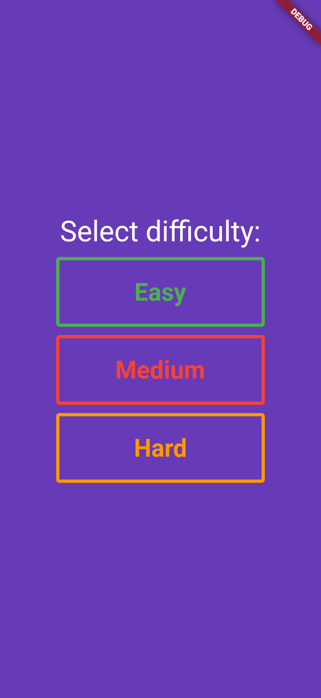
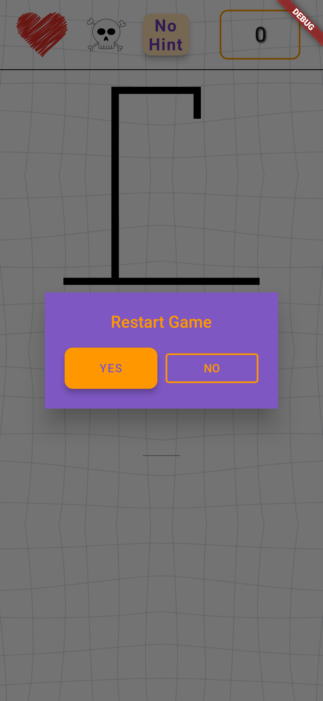

# Hangman-Game-Flutter
This is Hangman Game created using flutter from scratch.

## Working
This is fully hardcoded no additional libraries are used however for the generation of the words, [word_generator](https://pub.dev/packages/word_generator) lib is used .

## Testing
It perfectly works with Android and Web (Tested). Not tested with the Ios and Macos.

## Interface

    
    
    

Its easy to use.

**Note:** It will more furthur update like stages, difficulty level etc.